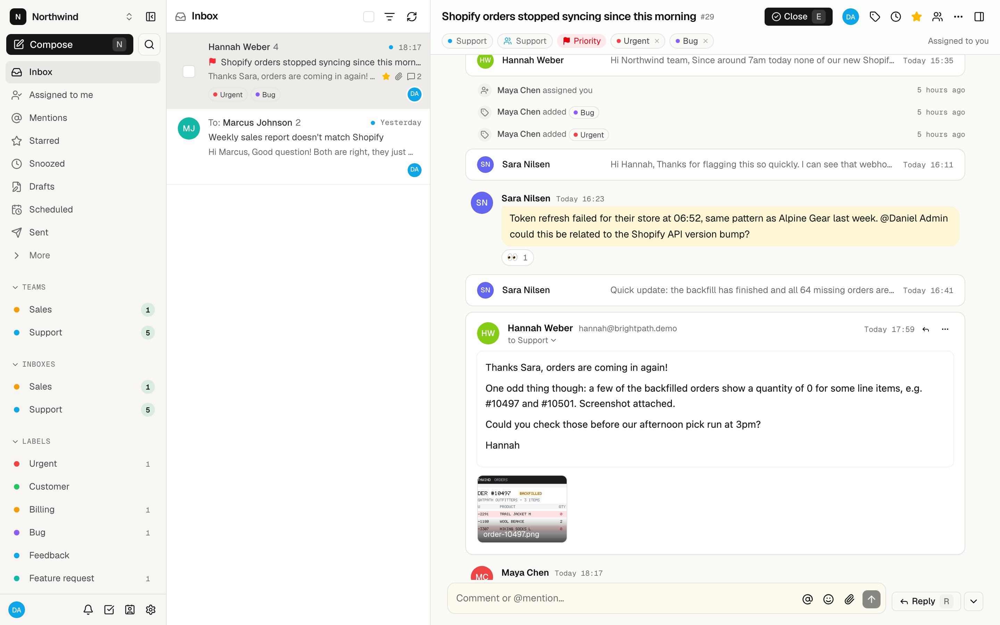
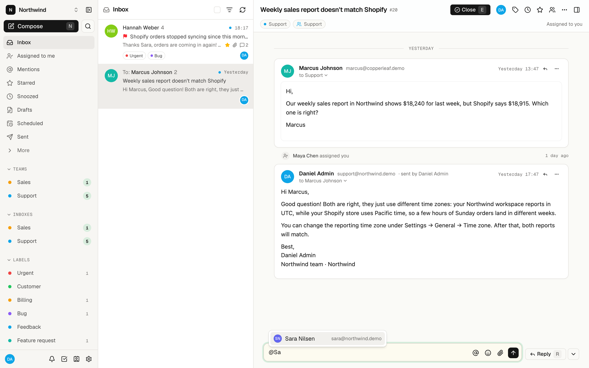
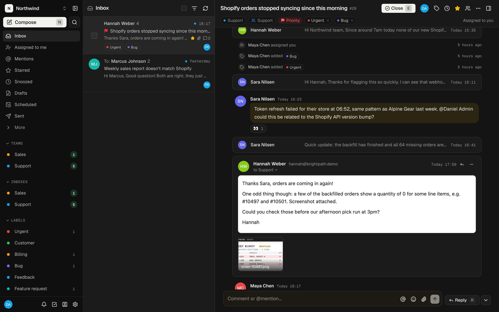
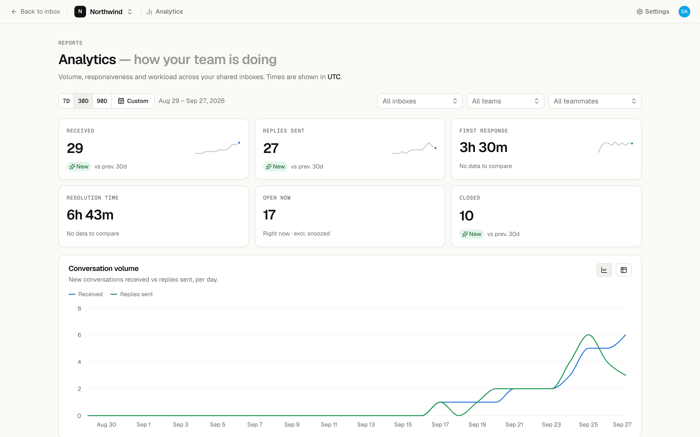
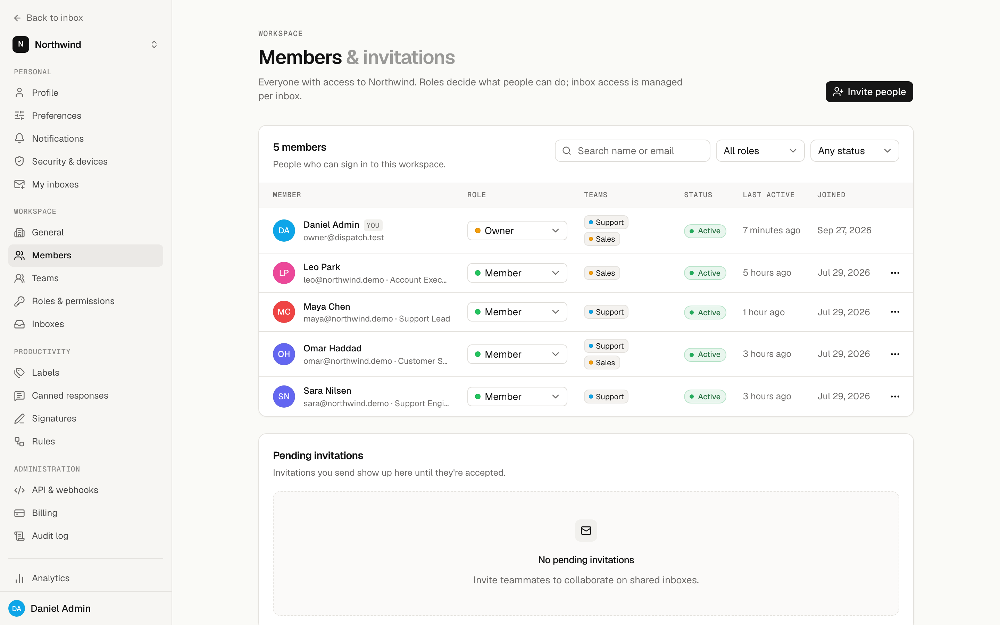
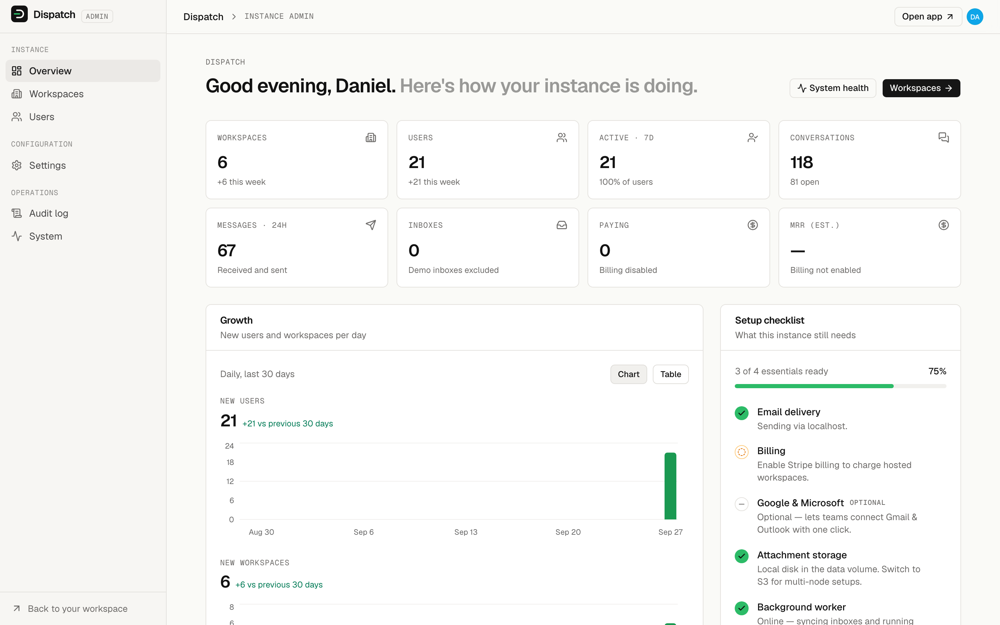
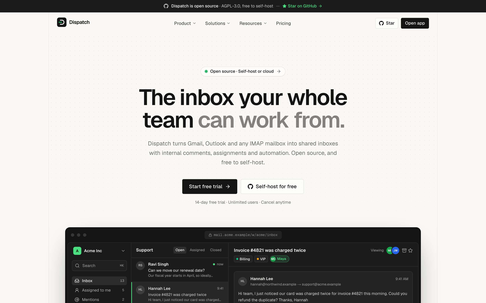
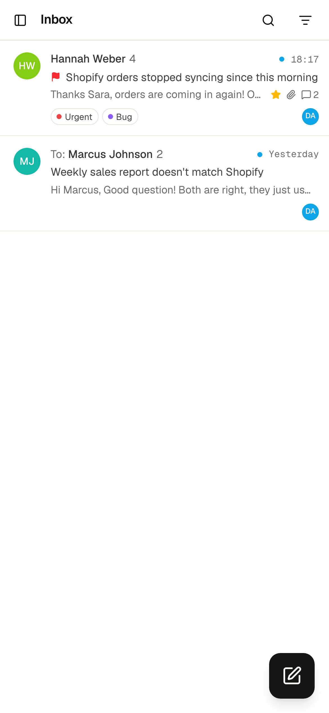
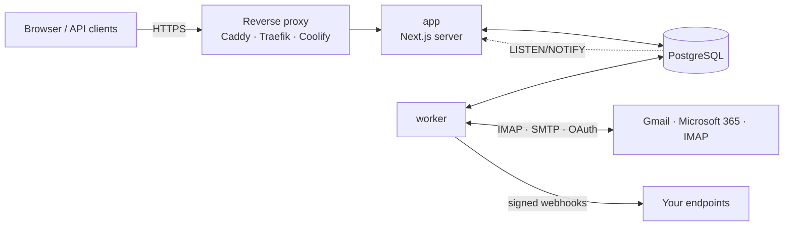

<div align="center">

<picture>
  <source media="(prefers-color-scheme: dark)" srcset="public/brand/logo-dark.svg">
  
</picture>

<h3>The open-source collaborative inbox for teams</h3>

<p>Shared Gmail &amp; IMAP inboxes, internal comments, assignments and automation.<br>
Self-host for free or use Dispatch Cloud for $50/month.</p>

[](LICENSE)
[](https://github.com/codextde/dispatch/stargazers)
[](https://github.com/codextde/dispatch/pkgs/container/dispatch)
[](https://github.com/codextde/dispatch/actions/workflows/ci.yml)
[](CONTRIBUTING.md)
[](docs/coolify.md)

[Docs](docs/README.md) · [Self-hosting](docs/self-hosting.md) · [Coolify](docs/coolify.md) · [API](docs/api.md) · [Contributing](CONTRIBUTING.md)

<br>



</div>

## Why Dispatch

**Email wasn't built for teams.** Shared passwords, `Fwd: Fwd:` chains, "did anyone reply to this?" and two people answering the same customer are what happens when a team works out of one mailbox. Dispatch turns the mailboxes you already have into shared inboxes. Your team assigns conversations, discusses them in internal comments next to the email thread, and sees who is replying in real time.

**Per-seat pricing punishes growth.** Collaborative inboxes usually charge per user, so every part-timer, freelancer or occasional helper costs another seat. Dispatch is free to self-host, and Dispatch Cloud is a flat **$50/month per workspace with unlimited users**.

**Own your data.** Your email is some of the most sensitive data your company has. Run Dispatch on your own server with one `docker compose up`, audit every line of code, and keep mail credentials encrypted on infrastructure you control.

## Features

**Shared inboxes**
- Gmail / Google Workspace and Outlook / Microsoft 365 via OAuth, or any IMAP/SMTP mailbox
- Team inboxes with per-user and per-team access, plus private personal inboxes
- Labels, snooze, send later, undo send, drafts, signatures and canned responses with variables
- Fast full-text search, and safe sandboxed email rendering with remote-image blocking

**Collaboration**
- Internal comments with @mentions right in the conversation
- Assignments, "assigned to me" and team views
- Realtime presence, typing indicators, collision detection and collaborative drafts
- Team chat with channels and direct messages
- Tasks linked to conversations, with assignees and due dates
- Shared contacts built automatically from your mail

**Automation & insights**
- Rules: when conditions match, label, assign, move, archive, notify or call a webhook
- Analytics: volume, first-reply time, resolution time, workload per teammate
- AI assistant for thread summaries and reply drafts, with your own Anthropic or OpenAI key
- REST API, API keys and signed webhooks

**Built for teams and operators**
- Many workspaces per instance, each with its own admins, custom roles and permissions
- Passwordless magic-link sign-in with sessions that last a year, on every device
- Audit log, encrypted credentials, strict CSP, SSRF protection
- Mobile-friendly UI with dark mode, keyboard shortcuts and a command palette
- Everything is configured in the browser. The `.env` only contains your domain.
- Optional Stripe billing to run Dispatch as a paid service yourself

## Screenshots

| | |
| :---: | :---: |
| <br>Conversation with internal comments | <br>Dark mode |
| <br>Analytics | <br>Workspace settings |
| <br>Instance admin | <br>Built-in marketing site (SaaS mode) |

<p align="center"><br><sub>Works on phones, too</sub></p>

## How Dispatch compares

| | **Dispatch** | Missive | Front | Hiver |
| --- | --- | --- | --- | --- |
| Pricing model | **Free self-hosted, or $50/month per workspace** | Per user | Per seat | Per user |
| List price per user/month¹ | **$0, unlimited users** | $14 / $24 / $36 | $25 / $65 / $105 | $25 / $55 / $85 |
| 10 users, mid tier¹ | **$0 self-hosted · $50 Cloud** | $240 | $650 | $550 |
| Open source | **Yes (AGPL-3.0)** | No | No | No |
| Self-hosting | **Docker Compose or Coolify** | No | No | No |
| All features on every plan | **Yes** | No | No | No |
| Shared inboxes, comments, assignments | Yes | Yes | Yes | Yes |

<sub>¹ Public list prices of the Starter / mid / top plans, per user per month billed annually, as published on the vendors' pricing pages in 2026. Monthly billing usually costs more. Check the vendors' sites for current pricing. Missive, Front and Hiver are trademarks of their respective owners, and each has strengths of its own, such as native apps and more channels.</sub>

## Quick start

On any server with Docker and a domain pointing to it:

```bash
curl -fsSLO https://raw.githubusercontent.com/codextde/dispatch/main/docker-compose.yml
echo "DOMAIN=mail.example.com" > .env
docker compose up -d
```

This starts the app, worker and PostgreSQL. The compose file publishes no ports, so put your reverse proxy in front of `app:3000`. Or download the [override with a bundled Caddy](docker-compose.override.example.yml) for automatic HTTPS:

```bash
curl -fsSL https://raw.githubusercontent.com/codextde/dispatch/main/docker-compose.override.example.yml -o docker-compose.override.yml
docker compose up -d
```

Then open `https://mail.example.com/setup`. Full guide: [docs/self-hosting.md](docs/self-hosting.md).

### Deploy on Coolify

Create a **Docker Compose** resource from this repository (or paste `docker-compose.yml`). Set the `app` service's domain to `https://mail.example.com:3000` and the environment variable `DOMAIN=mail.example.com`, then deploy. Coolify handles TLS. Step by step: [docs/coolify.md](docs/coolify.md).

### Configuration

The only setting is `DOMAIN`:

- The database password is generated by the database container on first boot.
- The encryption key is generated by Dispatch in its data volume.
- Everything else is configured in the browser: email delivery (SMTP or Amazon SES), Google and Microsoft OAuth apps, storage (local or S3), AI, branding, security, legal pages and billing.

See [docs/configuration.md](docs/configuration.md).

### First-run setup

Open `/setup` to create the instance owner (super admin). To prove you run the server, the wizard asks for a one-time **setup code**, which Dispatch prints to the app logs until an owner exists:

```bash
docker compose logs app | grep -A2 "setup code"
# Dispatch first-run setup code: XXXX-XXXX-XXXX
```

The wizard then checks the database, data directory and HTTPS. It walks you through the instance settings, email delivery and your first workspace, optionally with demo data. Until email delivery is configured, sign-in links are printed to `docker compose logs app` as well.

## Tech stack

- **App:** [Next.js 16](https://nextjs.org) (App Router), React 19, TypeScript
- **UI:** Tailwind CSS v4, [shadcn/ui](https://ui.shadcn.com) and Radix, Tiptap editor, lucide icons
- **Data:** PostgreSQL 17 with [Drizzle ORM](https://orm.drizzle.team), TanStack Query
- **Realtime:** Server-Sent Events over Postgres `LISTEN/NOTIFY`, with no Redis
- **Mail:** [ImapFlow](https://imapflow.com), mailparser, Nodemailer
- **Ops:** One Docker image (`linux/amd64`, `linux/arm64`) for app and worker, Docker Compose, Coolify

## Architecture



The **app** serves the UI, API and realtime stream. The **worker** syncs mailboxes, sends mail and runs rules, webhooks and scheduled jobs. **PostgreSQL** is the database, the job queue and the event bus. Details: [docs/architecture.md](docs/architecture.md).

## Roadmap

- [x] Shared inboxes for Gmail, Microsoft 365 and IMAP
- [x] Comments, mentions, assignments, team chat and tasks
- [x] Rules, analytics, AI assistant, REST API and webhooks
- [x] Multi-workspace instances with custom roles and Stripe billing
- [ ] SMS and WhatsApp channels
- [ ] Native iOS and Android apps
- [ ] Calendar integration (Google, Microsoft)
- [ ] SAML SSO and SCIM provisioning
- [ ] SLA policies and business hours
- [ ] Website live chat widget
- [ ] Importers for Missive and Front

Have an idea? [Start a discussion](https://github.com/codextde/dispatch/discussions) or upvote existing [feature requests](https://github.com/codextde/dispatch/issues?q=is%3Aissue+label%3Aenhancement).

## Contributing

Contributions are welcome: bug reports, docs, translations and code. Read [CONTRIBUTING.md](CONTRIBUTING.md) for the development setup and guidelines, and please follow our [Code of Conduct](CODE_OF_CONDUCT.md).

## Security

Please report vulnerabilities privately via [GitHub security advisories](https://github.com/codextde/dispatch/security/advisories/new), not in public issues. See [SECURITY.md](SECURITY.md).

## License

Dispatch is licensed under the [GNU Affero General Public License v3.0](LICENSE) (AGPL-3.0). In plain terms (not legal advice):

- **Self-hosting is free.** You can use Dispatch for your company, including commercially, on as many servers and with as many users as you like.
- **You can modify it.** If you let people use a modified version over a network, for example as a hosted service, you must offer them the source code of your modifications under the AGPL-3.0.
- **Running it as a service is allowed.** The same condition applies: changes you make must be published to your users under the AGPL.

Dispatch is built and maintained by [Codext GmbH](https://github.com/codextde), Germany. Dispatch Cloud is the hosted version run by the maintainers, and it funds development.

## Acknowledgements

Dispatch stands on the shoulders of great open-source projects, including [Next.js](https://github.com/vercel/next.js), [React](https://github.com/facebook/react), [Drizzle ORM](https://github.com/drizzle-team/drizzle-orm), [shadcn/ui](https://github.com/shadcn-ui/ui), [Radix](https://github.com/radix-ui/primitives), [Tiptap](https://github.com/ueberdosis/tiptap), [ImapFlow](https://github.com/postalsys/imapflow), [Nodemailer](https://github.com/nodemailer/nodemailer), [TanStack Query](https://github.com/TanStack/query), [PostgreSQL](https://www.postgresql.org) and [Lucide](https://github.com/lucide-icons/lucide). Thank you to their maintainers and contributors.
