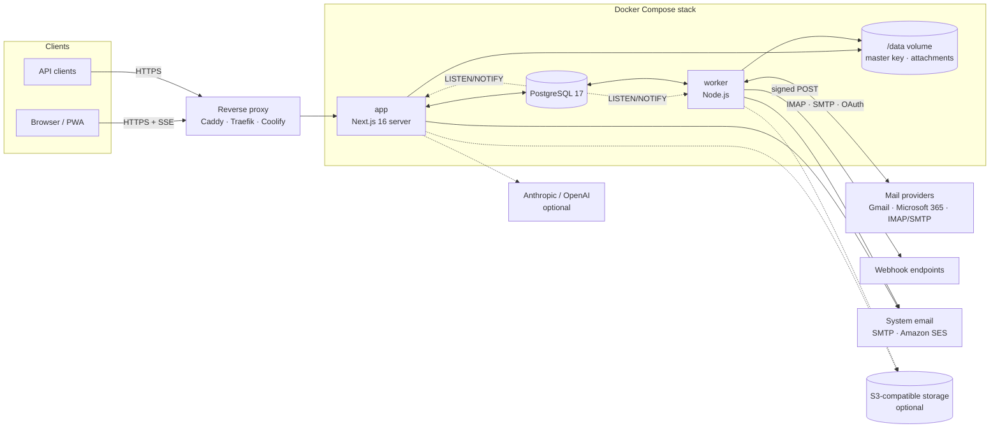
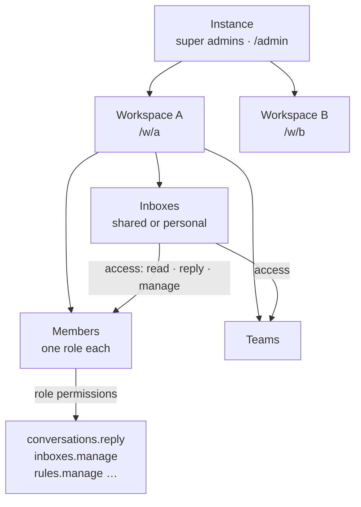

# Architecture

Dispatch is deliberately boring to operate: one Next.js application, one worker built from the same codebase, and PostgreSQL. There's no Redis, no message broker and no search cluster. Postgres handles storage, queues and realtime fan-out.

## Components

| Component | Role |
| --- | --- |
| **app** | Next.js 16 standalone server (App Router, React 19). Serves the UI, server actions, the REST API, OAuth callbacks, the Stripe webhook and the SSE realtime stream. Applies database migrations on start. |
| **worker** | Same image, `worker` command. Runs everything that must not live in a request: mailbox sync, outgoing mail, rules, webhooks, scheduled work. |
| **db** | PostgreSQL 17. The single source of truth, plus job queue and event bus. |
| **/data** | Persistent directory shared by app and worker: `secrets/master.key` and `storage/` (attachments when the storage driver is "local"). |

## Request flow and realtime

1. The browser talks to the **app**. Pages are React Server Components. Mutations go through server actions or the JSON API, and client data is cached with TanStack Query.
2. After a mutation that others should see, the server calls `publish()`, which runs `pg_notify('dispatch_events', …)` with a small payload (IDs and event type, never content).
3. Every app process holds one `LISTEN dispatch_events` connection and forwards matching events to its connected browsers over **Server-Sent Events** (`/api/w/<slug>/events`).
4. Clients refetch the affected queries. Permissions are enforced on the refetch, so an event never leaks data a user can't see.

The same channel carries presence (who's viewing a conversation), typing indicators and collaborative draft updates. Because the bus is Postgres, the worker publishes the same way, and running several app replicas works without extra infrastructure.

## Worker

The worker is a long-running Node.js process with a few independent loops:

| Loop | What it does |
| --- | --- |
| **Mailbox sync** | Keeps connected inboxes in sync over IMAP. It fetches new mail, threads it into conversations and mirrors state changes. OAuth tokens for Gmail and Microsoft 365 are refreshed automatically. |
| **Sending** | Delivers outgoing messages via the inbox's SMTP server. This covers *send later* and the *undo send* delay, and appends a copy to the Sent folder. |
| **Rules** | Evaluates automation rules (conditions → actions) for new and updated conversations. |
| **Webhooks** | Delivers queued webhook events with HMAC signatures and retries. |
| **Scheduler** | Reopens snoozed conversations, sends reminders and notification emails, and cleans up expired sessions, sign-in tokens and old job records. |

Jobs live in the `jobs` table. `enqueueJob()` inserts a row and sends `pg_notify('dispatch_jobs')`, so the worker picks it up immediately instead of waiting for its next poll. Jobs are claimed with `FOR UPDATE SKIP LOCKED` and retried with exponential backoff up to their `maxAttempts`, so several workers can safely run side by side.

## Data model

All tables live in one Postgres schema (`src/server/db/schema.ts`, migrations in `drizzle/`).

| Area | Tables |
| --- | --- |
| Instance | `instance_settings` (JSON per section, secrets encrypted), `jobs`, `rate_limits` |
| Identity | `users`, `sessions`, `login_tokens` |
| Tenancy | `organizations` (workspaces), `memberships`, `roles`, `invitations`, `teams`, `team_members` |
| Inboxes | `accounts` (connected mailboxes), `account_access`, `mailbox_sync_state` |
| Conversations | `conversations`, `messages`, `attachments`, `conversation_assignees`, `conversation_user_state` (read, snooze, archive per user), `conversation_events` (timeline) |
| Collaboration | `comments`, `reactions`, `labels`, `conversation_labels`, `tasks`, `contacts` |
| Productivity | `canned_responses`, `signatures`, `rules`, `notifications` |
| Integrations | `api_keys`, `webhooks`, `webhook_deliveries` |
| Compliance | `audit_logs` |

Team chat reuses the conversation model (`kind = 'chat'`), so comments, mentions, reactions and notifications work the same everywhere.

## Multi-tenancy and permissions

- **Instance.** One installation hosts any number of workspaces. Super admins manage instance settings, users and workspaces in `/admin`.
- **Workspace.** Every tenant row carries an `org_id`, and every query filters by it. A user can belong to several workspaces and switches between them at `/w/<slug>`.
- **Roles.** Each member has one role per workspace. Owner, Admin, Member and Guest are built in, and admins can create custom roles from the permission catalog in `src/lib/permissions.ts`. Permissions gate actions such as replying, assigning, managing inboxes, rules, members, billing and the audit log.
- **Inbox access.** Visibility is separate from the role. A shared inbox is granted to users or teams with `read`, `reply` or `manage`, and personal inboxes are private to their owner unless shared. All conversation queries go through `src/server/access.ts`.
- **Billing lock.** In SaaS mode with billing enforced, a workspace without an active subscription becomes read-only. Mutations call `assertWritable()`.

## Security model

| Concern | Approach |
| --- | --- |
| Sign-in | Passwordless magic links and codes: single-use, short-lived, stored hashed and rate-limited. Optional Google / Microsoft sign-in. |
| Sessions | Random 256-bit tokens, stored as SHA-256 hashes, in an `httpOnly`, `SameSite=Lax` cookie (`Secure` over HTTPS). Valid for up to a year and revocable per device. |
| CSRF | Cookie-authenticated mutations must be same-origin (`Sec-Fetch-Site` / `Origin` checks); server actions have built-in origin checks. |
| API keys | `dsp_…` bearer tokens scoped to one workspace, stored as hashes, revocable, optional expiry. |
| Secrets at rest | Mailbox passwords, OAuth tokens and SMTP, Stripe, AI and S3 keys are encrypted with AES-256-GCM. Keys are derived via HKDF from the master key (`/data/secrets/master.key` or `DISPATCH_SECRET`). |
| Email rendering | HTML is sanitized and rendered in a sandboxed iframe without script execution. Remote images are blocked or asked for, per instance policy. |
| Browser hardening | Strict Content Security Policy, `frame-ancestors 'none'`, HSTS, `nosniff`, restrictive Permissions-Policy. |
| Outbound connections | Optional blocking of private network ranges for IMAP/SMTP hosts and webhook URLs (SSRF protection, recommended for SaaS). |
| Webhooks | HMAC-SHA256 signatures with a timestamp against replay. |
| Audit | Security-relevant actions are written to `audit_logs`, visible to workspace admins. |
| Containers | Run as a non-root user. The database is not published on the host, and its password is generated per installation. |

See [Security](security.md) for the threat model and how to report vulnerabilities.
