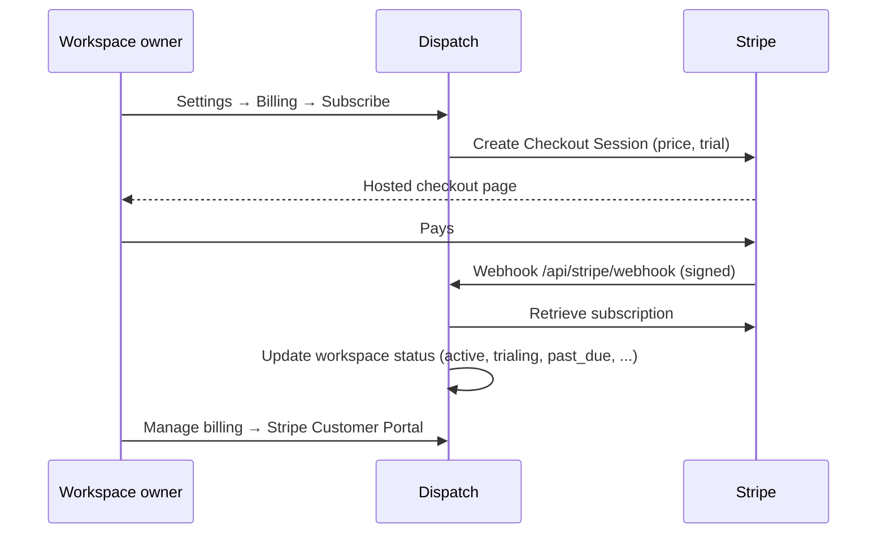

# Billing: running Dispatch as a paid service

Most self-hosters can skip this page. Billing is off by default, and a private instance never talks to Stripe.

Turn billing on if you run Dispatch as a **hosted service for other companies**, like Dispatch Cloud does. Each workspace then pays a flat subscription (Dispatch Cloud: $50/month per workspace, unlimited users) through Stripe Checkout, and workspaces without an active subscription become read-only.

## How it works



- **Instance mode:** billing only applies when *Admin → Settings → General → Mode* is **SaaS** and billing is enabled in *Admin → Settings → Billing*.
- **Plans:** every workspace has a plan.
  - `cloud` is paid, and only this plan is subject to billing.
  - `free` and `comped` are free forever, set by a super admin.
  - `self_hosted` is the default on private instances.
- **Trial:** new workspaces get the configured trial (default 14 days). A trial that's still running carries over into Stripe when the owner subscribes early, so subscribing never shortens it.
- **Enforcement:** with *Lock workspaces without an active subscription* on, a `cloud` workspace becomes **read-only** when its trial has ended or the subscription is canceled or unpaid. Data is never deleted. `past_due` stays writable while Stripe retries the payment.
- **Owners** (and roles with *Manage billing*) subscribe, update payment methods and download invoices in the Stripe Customer Portal.

## Setup

### 1. Stripe account

1. Create or open your [Stripe account](https://dashboard.stripe.com) and complete activation for live payments.
2. **Settings → Billing → Customer portal:** activate the portal. Allow customers to update payment methods, view invoices and cancel subscriptions.
3. Optional: configure **Stripe Tax** and your invoice template, logo and brand color under *Settings → Business*.

Start in **test mode** with test keys, then repeat the steps with live keys.

### 2. API keys

In *Developers → API keys*, copy the **Publishable key** (`pk_…`) and create a **Secret key** (`sk_…`). A restricted key works too if it has write access to Customers, Checkout Sessions, Customer portal, Products, Prices and Subscriptions.

### 3. Webhook

In *Developers → Webhooks → Add endpoint* (Workbench: *Webhooks → Create an event destination*):

- **Endpoint URL:** `https://<DOMAIN>/api/stripe/webhook`
- **Events:**
  - `checkout.session.completed`
  - `customer.subscription.created`
  - `customer.subscription.updated`
  - `customer.subscription.deleted`
  - `invoice.paid`
  - `invoice.payment_failed`

Copy the endpoint's **Signing secret** (`whsec_…`).

Dispatch verifies every webhook signature, ignores duplicate deliveries, and re-fetches the subscription from Stripe on each event, so retries and out-of-order events are safe.

### 4. Configure Dispatch

1. *Admin → Settings → General:* set **Mode** to **SaaS**. This also enables the public marketing site and self-service sign-up, depending on your authentication settings.
2. *Admin → Settings → Billing:* enable billing and enter:

| Field | Example | Notes |
| --- | --- | --- |
| Secret key | `sk_live_…` | Stored encrypted |
| Publishable key | `pk_live_…` | |
| Webhook signing secret | `whsec_…` | Stored encrypted |
| Amount | `5000` | In the smallest currency unit (cents): 5000 = $50.00 |
| Currency | `usd` | Any Stripe currency code |
| Interval | `month` | `month` or `year` |
| Trial days | `14` | `0` disables trials |
| Lock unpaid workspaces | on | Read-only mode for `cloud` workspaces without an active subscription |

You don't need to create a product or price in Stripe. On the first checkout, or when you click **Create/refresh product & price**, Dispatch creates the product "\<Product name\> Cloud" and a recurring price matching your amount, currency and interval, and stores their IDs. If you change the amount later, Dispatch creates a new price, makes it the default and archives the old one. Existing subscriptions keep their price until you migrate them in Stripe.

### 5. Test

With test keys:

1. Create a workspace, then open *Settings → Billing → Subscribe*.
2. Pay with card `4242 4242 4242 4242`, any future date and any CVC.
3. The workspace shows as active within a few seconds. Check *Developers → Webhooks → (endpoint)* for successful deliveries.
4. Try `4000 0000 0000 0341` (attaches, then fails to charge) to test `invoice.payment_failed`.

To test webhooks against a local instance, use the Stripe CLI:

```bash
stripe listen --forward-to localhost:3000/api/stripe/webhook
```

Then paste the `whsec_…` it prints into *Admin → Settings → Billing*.

## Comped and free workspaces

In *Admin → Workspaces*, a super admin can set a workspace's plan to **comped** (e.g. friends, open-source projects, your own team) or **free**. These workspaces are never locked and can't start a checkout. Switching back to **cloud** makes billing apply again.

## Going live checklist

- [ ] Live keys and a live webhook endpoint with the six events
- [ ] Customer portal activated in live mode
- [ ] Legal pages (imprint, privacy policy, terms) filled in under *Admin → Settings → Legal*
- [ ] System email delivery configured ([Email delivery](email-delivery.md)), because receipts come from Stripe but invitations and sign-in links come from Dispatch
- [ ] *Admin → Settings → Security → Block private networks* enabled, so customers can't make your server connect to internal addresses
